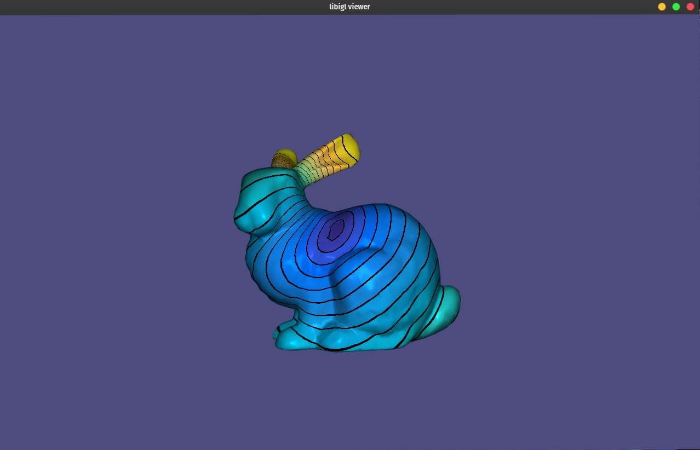

# Biharmonic Distance

The biharmonic distance between two points (x,y) is a distance measure based on the biharmonic differential operator.
It provides a good trade-off between nearly geodesic distances for small distances and global shape-awareness for large distances.
Furthermore, it has all of the following properties:
1) metric: non-negative, satisfies the identity of indiscernibles, symmetric, and satisfies the triangle inequality; 
2) gradual: smooth with respect to perturbations of x and y, with no singularities except derivative discontinuity at x; 
3) locally isotropic: approximately geodesic when y is near x;
4) globally “shape-aware:” reflects the overall shape of the surface when y is far from x;
5) isometry invariant: does not change with isometric transformations of the surface;
6) insensitive to noise and topology: does not change significantly with the addition of noise or changes to topology;
7) practical to compute: compute times between all pairs of points in common meshes take at most a few minutes;
8) parameter-free: independent of any parameter that must be set differently for specific meshes or applications

The biharmonic distance between points can be computed using the eigenvectors and eigenvalues of the Laplace-Beltrami operator:

The biharmonic distance between all pairs of vertices can easily be calculated as follows:
 
    biharmonic_distance(V, F, D);

where D is a #V by #V matrix which stores the biharmonic distance between each vertex.

